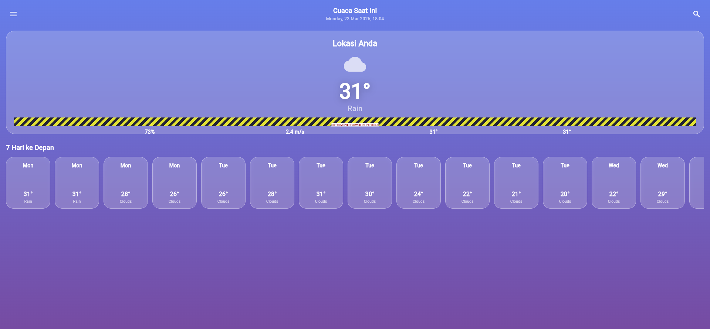

# App Cuaca - Web

Aplikasi web cuaca modern yang dibangun dengan Flutter (Web platform). Menampilkan informasi cuaca real-time dengan UI yang indah dan responsif.

## 🌟 Fitur

- **Pencarian lokasi** - Cari kota mana saja di seluruh dunia
- **Data cuaca real-time** - Suhu, kelembapan, kecepatan angin, tekanan udara
- **Forecast 7 hari** - Prakiraan cuaca untuk satu minggu ke depan
- **Desain modern** - Gradient dinamis, glassmorphism, dan animasi cuaca
- **Responsif** - Tampilan optimal di desktop, tablet, dan mobile
- **Icon weather animasi** - Visualisasi kondisi cuaca yang hidup

## 🚀 Teknologi

- **Flutter 3.x** - UI toolkit untuk aplikasi natif lintas platform
- **Dart** - Bahasa pemrograman
- **OpenWeatherMap API** - Sumber data cuaca (dibutuhkan API key)
- **HTML/CSS/JS** - Build untuk web

## 📂 Struktur Proyek

```
app-cuaca-repo/
├── assets/
│   └── app_cuaca.png    # Screenshot aplikasi
├── lib/
│   └── main.dart        # Kode utama aplikasi
├── web/
│   └── index.html       # Entry point web
├── pubspec.yaml         # Dependencies Flutter
├── README.md            # File ini
└── (file build lainnya)
```

## ⚙️ Setup & Konfigurasi

### 1. Install Flutter
Pastikan Flutter terinstal sesuai [instruksi resmi](https://flutter.dev/docs/get-started/install).

### 2. Clone Repository
```bash
git clone https://github.com/GalibSajad/app-cuaca.git
cd app-cuaca
```

### 3. Install Dependencies
```bash
flutter pub get
```

### 4. Konfigurasi API Key
Buat file `.env` di root proyek:
```
OPENWEATHER_API_KEY=your_api_key_here
```
*Catatan: `.env` sudah di-*.gitignore* untuk keamanan.*

### 5. Jalankan di Browser (Development)
```bash
flutter run -d chrome
```

### 6. Build untuk Produksi
```bash
flutter build web
```
Hasil build akan ada di folder `build/web/`.

## 🌐 Deploy

Folder `build/web/` bisa didirectly deploy ke:
- GitHub Pages
- Firebase Hosting
- Netlify
- Vercel
- Atau web server statis mana pun

Contoh deploy ke GitHub Pages:
```bash
flutter build web
cd build/web
git init
git add .
git commit -m "Deploy to GitHub Pages"
git push -f https://github.com/GalibSajad/app-cuaca.git master:gh-pages
```

## 📸 Preview



## 🔐 Keamanan

- API key **tidak** di-commit ke repository
- File `.env` sudah ada di `.gitignore`
- Untuk production, gunakan environment variables atau secret manager

## 📝 Catatan

- Proyek ini merupakan hasil pengembangan Flutter untuk platform web
- UI menggunakan gradient dinamis dan efek glassmorphism
- Data cuaca diambil dari OpenWeatherMap API (free tier)

## 📬 Kontak

- Author: Galib Sajad
- GitHub: [@GalibSajad](https://github.com/GalibSajad)

---

Dibuat dengan ❤️ menggunakan Flutter
